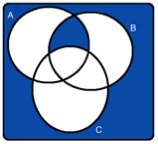
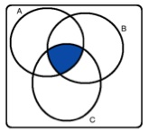
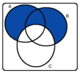
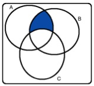

```{r setup, include=FALSE}
library(learnr)
knitr::opts_chunk$set(echo = FALSE)
```
<style>body{text-align: justify}</style>
### 1.
<b>Shown below are four Venn diagrams.</b>

   

```{r q1}
question("In which of the diagrams does the shaded area represent
         A and B and C?",
         answer("a"),answer("b",correct = TRUE),answer("c"),answer("d"))
```

### 2.

```{r q2}
question("Which of the following is false about probability distributions?",
         answer("The outcomes listed must be independent.",correct = TRUE),
         answer("Each probability should be greater than or equal to 0."),
         answer("Each probability should be positive, less than or equal to 1."),
         answer("The probabilities must total 1."))
```

### 3.

```{r q3}
question("Last semester, out of 170 students taking a particular statistics class, 71 students were
         “majoring” in social sciences and 53 students were majoring in pre-medical studies. There
         were 6 students who were majoring in both pre-medical studies and social sciences. What is
         the probability that a randomly chosen student is majoring in social sciences, given that 
         s/he is majoring in pre-medical studies?",
        answer("6/170"),
        answer("(71+53−6)/170"),
        answer("6/71"),
        answer("6/53",correct = TRUE))
```