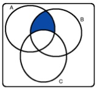

```{r setup, include=FALSE}
library(learnr)
knitr::opts_chunk$set(echo = FALSE)
```

### 1.

```{r q1}
question("Which of the following explains the phenomenon that while in 10 flips of a fair coin it
         may not be very surprising to get 8 Heads, it would be very surprising to get 8,000 Heads
         in 10,000 flips of the coin.",
         answer("Law of large numbers",correct = TRUE),
         answer("Bayes’ theorem"),
         answer("General addition rule"),
         answer("Law of averages"))
```

### 2.

Shown below are four Venn diagrams. 

   

```{r q2}
question("In which of the diagrams does the shaded area represent A or B but not C?",
         answer("a",correct = TRUE),answer("b"),answer("c"),answer("d"))
```

### 3.

```{r q3}
question("Each choice below shows a suggested probability distribution for letter grades in a class
         (Possible grades are A, B, C, or D or lower). Determine which is a proper probability
         distribution.",
         answer("A: 0.30, B: 0.30, C: 0.40, D or lower: 0",correct = TRUE),
         answer("A: 0.20, B: 0.40, C: 0.50, D or lower: -0.10"),
         answer("A: 0.10, B: 0.20, C: 0.50, D or lower: 0.10"),
         answer("A: 0.30, B: 0.30, C: 0.30, D or lower: 0.30"))
```

### 4.

<b>Assortative mating is a nonrandom mating pattern where individuals with similar genotypes
and/or phenotypes mate with one another more frequently than what would be expected under
a random mating pattern. Researchers studying this topic collected data on eye colors of
204 Scandinavian men and their female partners. The table below summarizes the results.
For simplicity, assume heterosexual relationships.</b>

```{r q4a}
jpeg::readJPEG("fig9.jpg") -> x
grid::grid.raster(x)
```

```{r q4b}
question("What is the probability that a randomly chosen male respondent with blue eyes has a
         partner with blue eyes?",
         answer("(108+114−78)/204"),
         answer("78/204"),
         answer("78/114",correct = TRUE),
         answer("78/108"))
```

### 5.

```{r q5}
question("Which of the following is false?",
         answer("If two events (both with probability greater than 0) are mutually exclusive, they
         could be independent.",correct = TRUE),
         answer("If two outcomes of a random process (both with probability greater than 0) are
         mutually exclusive, they are not necessarily complements."),
         answer("When computing the probability that a card drawn randomly from a standard deck is 
         either a Jack or a 4, you can use the addition rule."),
         answer("If the probabilities of two mutually exclusive outcomes of a random process add up
         to 1, they are complements."))
```
